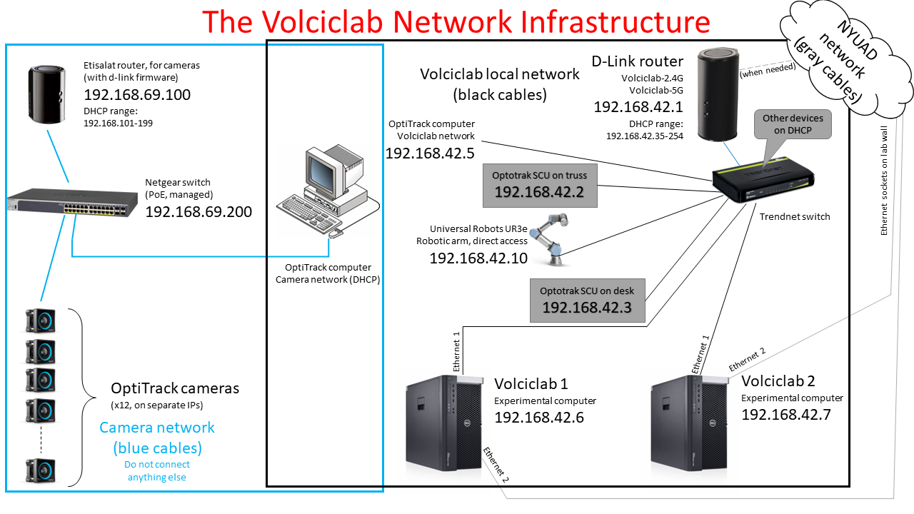

# Volciclab utilities

This is a repository of all the internally-made scripts and applications for the lab of Prof. Volcic at New York University Abu Dhabi. While these are intended for internal use, someone out there may find a use for it as well.

## The Volciclab Network Infrastructure

When you come visit the lab, the wiring on the truss may not look like much, but there are more than 120 metres of Ethernet cables routed in it. Here is why:

All the local networks inside the lab are isolated from the outside world by default. The camera network is connected to the Netgear 24-port switch, with the subnet of `192.168.69.x`. The Volciclab network as two WiFi access points: `Volciclab-2.4G` and `Volciclab-5G`. The lab computers, the 3D printer, and the Optotrak SCUs are all connected to this. This network's IP addresses are on the subnet of `192.168.42.x`. For particular IP addresses, check the hardware in the lab, or refer to the network map.

### Blue cables: The [OptiTrack](OptiTrack/Readme.md) camera network

The [OptiTrack](OptiTrack/Readme.md) cameras are connected to the Netgear PoE ([Power over Ethernet](https://en.wikipedia.org/wiki/Power_over_Ethernet)) switch. While these are sitting on the network, they don't actually care about a DHCP server at all. They just assume various addresses, seemingly in bootup order or serial number order. They will cause an IP address conflict if the DHCP range is within the camera addresses. To counteract this, the router is configured to have a DHCP range from `192.168.69.101` to `192.168.69.199`.

Note that the OptiTrack computer that runs Motive is connected to this network via a deicated PCI-E network adapter.

### Black cables: The Volciclab internal network

If you have an own device or anything that doesn't upport IEEE 802.1X, you can connect to this network. The password for this network is not disclosed here, ask for it. There are certain things that have to be on a fixed IP. These are:

* The Optotrak SCUs: `192.168.42.2` (on the truss), and `192.168.42.3` on the desk, but can be portable
* The OptiTrack computer, `192.168.42.5`. This one has a Samba share, so you can download and store your recordings (You should also make backups as well. No data should ever be lost!)
* The **Ethernet 1 port, as labelled on the back, not as per Windows of the experimental computers**: `192.168.42.6` and `192.168.42.7`
* The [Universal Robots UR3e robotic arm](robot_server/Readme.md), which is on `192.168.42.10`
* Everything else (3D printer, your gadgets, IoT stuff) can be on DCHP, and will have an IP address from `192.168.42.35` onwards.

### Gray cables: NYUAD uplink

For the purpose of software development and firmware upgrades, the Volciclab network can also be connected to the NYUAD network. The Ethernet 2 port (as labelled on the back, and not necessarily as per Windows) is permanently connected to the NYUAD network.

#### A note on networks

Since there are disjoint networks, and some of the hosts are on fixed IP while others on DHCP, packet routing can be an issue. For example, when a request is sent to the robot, but the OS routes it to an other network, the connection cannot be made. For this reason, on Windows, the interfaces are prioritised: the interface metrics are not assigned automatically, they are manually set.

## Hardware (links to the appropriate sites)

### [Optotrak motion tracker](http://www.github.com/volcic/motom-toolbox)

This is the legacy motion tracker. It's no longer sold by the manufacturer, mostly because the internal components have been discontinued about a decade ago and they finally ran out.

### [OptiTrack motion tracker](OptiTrack/Readme.md)

This one is the fancy new one with the copious number of cameras. There is a simple matlab interface available, and is much easier to use than the Optotrak.

### [Robot server](robot_server/Readme.md)

While you can control the robot directly using TCP commands and send it scripts, nobody expects you to go through 600 pages of documentation and cryptic error messages. This server, along with the software on the robot's controller, implmenets a simple plain text-based protocol, and added some extra features that normally would require a PLC.

### [That Velmex thing](Velmex/Readme.md)

The Velmex Thing is a contraption of two linear stages and a 'rotary table'. It is controlled over a serial port.
