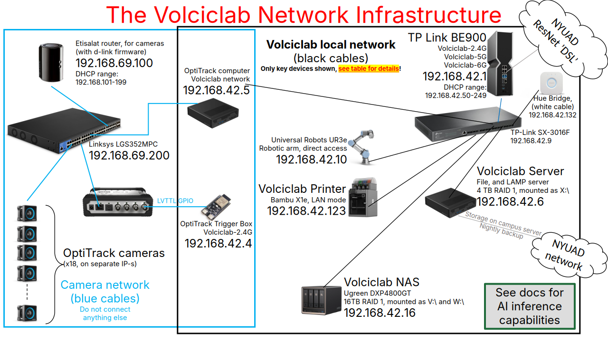

# Volciclab utilities

This is a repository of all the internally-made scripts and applications for the lab of Prof. Volcic at New York University Abu Dhabi. While these are intended for internal use, someone out there may find a use for it as well.

## The Volciclab Network Infrastructure

When you come visit the lab, the wiring on the truss may not look like much, but there are more than 120 metres of Ethernet cables routed in it. Here is why:

All the local networks inside the lab are isolated from the outside world by default via the router's firewall. The camera network is connected to the Linksys 48-port POE switch, with the subnet of `192.168.69.x`. The Volciclab network as two WiFi access points: `Volciclab-2.4G`, `Volciclab-5G` and `Volciclab-6G`. The lab computers, the 3D printer, and the Optotrak SCUs are all connected to this. This network's IP addresses are on the subnet of `192.168.42.x`. For particular IP addresses, check for labels on the hardware in the lab, or refer to the network map.

If possible, due to the heavy wifi use on campus, prioritise connecting to `Volciclab-6G`, or `Volciclab-5G`. Only use `Volciclab-2.4G` when the conditions are dire or you are using some device that doesn't support anything else.

For now, fancy things like WiFi 7's MLO features are disabled. We also have the option to create a mesh infrastructure, in case the bandwidth of the lab network access is insufficient from the office area.

Again, any device connected the the Volciclab network should prioritise 6 Ghz, then 5 Ghz, and **only use 2.4 GHz as last resort**.

### Blue cables: The [OptiTrack](OptiTrack/Readme.md) camera network

The [OptiTrack](OptiTrack/Readme.md) cameras are connected to the Netgear PoE ([Power over Ethernet](https://en.wikipedia.org/wiki/Power_over_Ethernet)) switch. While these are sitting on the network, they don't actually care about a DHCP server at all. They just assume various addresses, seemingly in bootup order or serial number order. They will cause an IP address conflict if the DHCP range is within the camera addresses. To counteract this, the router is configured to have a DHCP range from `192.168.69.101` to `192.168.69.199`.

| IP address | Fixed/DHCP | Description |
| --------- | ---------- | -------- |
| `192.168.69.100` | `Static IP` | Old Etisalat-branded D-Link DIR-851 router. It just works as a DHCP server. |
| `192.168.69.200` | `Static IP` | Linksys LGS352MPC POE Managed Switch |
| `192.168.69.101 ... 199` | `DHCP Range` | The cameras use a custom proprietary protocol, they don't care about this anyway. |

Note that the OptiTrack computer that runs Motive is connected to this network via a dedicated PCI-E network adapter.

### Black cables: The Volciclab internal network

If you have an own device or anything that doesn't support IEEE 802.1X, you can connect to this network. The password for this network is not disclosed here, ask for it. There are certain things that have to be on a fixed IP. These are:

| IP address | Static?/DHCP? | Description |
| --------- | ---------- | -------- |
| `192.168.42.1` | `Static IP` | TP Link Archer BE900 router. |
| `192.168.42.2` | `Static IP` | Optotrak Certus SCU on top of the truss. Turn it on manually, along with the cameras if you want to use it. Hopefully you'll never need this. |
| `192.168.42.3` | `Static IP` | Portable Optotrak Certus SCU, if needed. Hopefully not. |
| `192.168.42.4` | `Static IP` | `![via WiFi]`, connected to `Volciclab-2.4G`: homebrew trigger box connected to OptiTrack eSync 2, for precision closed-loop control. |
| `192.168.42.5` | `Static IP` | Motherboard's Ethernet socket on the OptiTrack computer. |
| `192.168.42.6` | `Static IP` | `Ethernet 1` of `Volciclab Server`. |
| `192.168.42.7` | `Static IP` | `Ethernet 1` of `Volciclab 1`. |
| `192.168.42.8` | `Static IP` | `Ethernet 1` of `Volciclab 2`, i.e. the 'decent' workstation. |
| `192.168.42.9` | `Static IP` | TP-Link SX3016F 10G managed switch. |
| `192.168.42.10` | `Static IP` | Internal Ethernet connector of the main unit [of the UR3e robot](robot_server/Readme.md). |
| `192.168.42.11` | `Static IP` | `![via WiFi]`, connected to `Volciclab-6G` `volciclab-spark-one` The 200 Gbit/s link's static IP address is `192.168.43.11`. |
| `192.168.42.12` | `Static IP` | `![via WiFi]`, connected to `Volciclab-6G` `volciclab-spark-two` The 200 Gbit/s link's static IP address is `192.168.43.12`. |
| `192.168.42.15` | `Static IP` | `wls5` (wifi) on `zoltan-nyuad-desktop`. |
| `192.168.42.16` | `Static IP` | `LAN2` port on NAS (also on volciclab-nas.local:9999), located on top of the silver file server and AI inference rack. |
| `192.168.42.50 ... 249` | `DHCP Range` | Configured DHCP range for literally every other device on the network. |
| `192.168.42.123` | `DHCP Reserved` | Bambu 3D printer, when configured in LAN mode, plugged to a LAN port of the router. |
| `192.168.42.132` | `DHCP Reserved` | Philips Hue Bridge. |
| `192.168.42.207` | `DHCP Reserved` | 2.5G Ethernet port of `volciclab-nuc`. |

Note that the IP addresses seem arbitrary. They are not. As the lab grew organically, the IP addresses are kept static. So code that was written a long time ago (say 2018) will run today, if needed.

Also note that the that the TP-Link SX3016F switch does not support old devices that are not capable of at least 1 Gbit/s. **Things that use less than 1GBase-T Ethernet must be connected via a desktop switch or plugged to a free LAN port of the router directly.**

### Gray cables: Uplink to ResNet or NYUAD

For the purpose of software development and firmware upgrades, the Volciclab network is connected to ResNet, which is essentially a general-purpose network to access the internet. NYUAD resources are not available through this connection. The Ethernet 2 port (as labelled on the back, and not necessarily as per Windows) on Volciclab Server is permanently connected to the NYUAD network, for the purpose of automated backups to a NYUAD-operated shared drive.

#### A note on networks

Since there are disjoint networks, and some of the hosts are on fixed IP while others on DHCP, packet routing can be an issue. For this reason, there are no routes defined across network adapters in any system.

## Hardware (links to the appropriate sites)

### [Optotrak motion tracker](http://www.github.com/volcic/motom-toolbox)

This is the legacy motion tracker. It's no longer sold by the manufacturer, mostly because the internal components have been discontinued about a decade ago and they finally ran out.

### [OptiTrack motion tracker](OptiTrack/Readme.md)

This one is the fancy new one with the copious number of cameras. There is a simple matlab interface available, and is much easier to use than the Optotrak.

### [Robot server](robot_server/Readme.md)

While you can control the robot directly using TCP commands and send it scripts, nobody expects you to go through 600 pages of documentation and cryptic error messages. This server, along with the software on the robot's controller, implments a simple plain text-based protocol, and added some extra features that normally would require a PLC.

### [The Velmex Thing](Velmex/Readme.md)

The Velmex Thing is a contraption of two linear stages and a 'rotary table'. It is controlled over a serial port.

### [Lights](Lights/Readme.md)

There are two sets of lights in the lab. There is a set of Philips Hue lights for creating calibrated illumination in the lab. [See this code](https://github.com/ha5dzs/philips-hue-v2-lab-lights) to use it in a slightly more controlled manner than what the Hue app allows. Additionally, there are some DMX512 lights which can be driven with the cheap USB adapter [using this software](https://github.com/ha5dzs/udmx-matlab-commander). These is for creating illuminations for an experiment and can be directly controlled from Matlab.

### [AR/VR/XR Stuff](volciclab_specific_unity_scripts/Readme.md)

This is a collection of scripts for implementing an experiment using a stand-alone Andorid VR headset and Unity.

### [Archives](archival_regime.md)

While there are cold-storage backups regularly made, this is a special regime that uses optical discs. May we never need this. These are neither incremental nor 'Towers of Hanoi' backups, they are just full backups that are to be taken yearly, ideally during the short time time when there is no data actively being collected.

### AI Inference at Volciclab

We have LLM servers for isolated agentic coding and exploratory data analysis, and to a limited degree, we have image generation capability. As this field is rapidly changing, it's best to ask or explore what is the current latest & greatest. Note that not everything is being, or can be run at the same time. But, in principle:

| What service | Listens at: | Max GPU memory |
| ------------ | ----------- | ------------ |
| Ollama | http://192.168.42.8:11434 | 76 GB |
| Lemonade | http://192.168.42.8:13305 | 76 GB |
| Ollama | http://192.168.42.11:11434 | 128 GB |
| Ollama | http://192.168.42.12:11434 | 128 GB |
| vLLM | http://192.168.42.11:8000 | 256 GB (limited to 200 Gbit/s across nodes!) |
| Lemonade | http://192.168.42.11:13305 | 128 GB |
