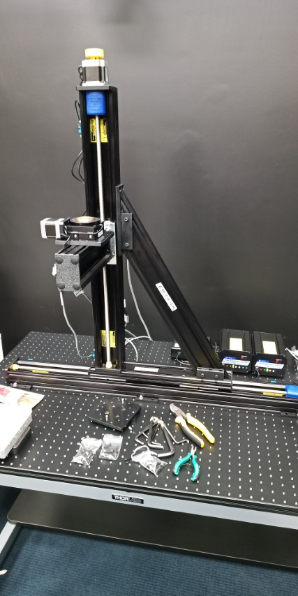

# The Velmex Thing

The Velmex thing is a universal set of linear stages and a rotator. Each linear stage has two end stop switches and a PK266 stepper motor. The threaded rod has a pitch of 1 mm. The rotator only has a Hall-sensor to detect zero position. In additoon, it has a smaller, PK245 motor, and a 90:0 reduction gear set.

Each motor has a step of 1.8°, so there are 200 steps per revolution. Since this system is difficult to get and is on the market for a long time, it is not as universal as other devices in Volciclab. The code is hard-coded for this configuration:

* Axis 1 is for the long stage
* Axis 2 is for the 'short' stage
* Axis 3 is for the rotator

This is just for the electrical connections, of course you are free to change the physical arrangement of this device, as long as the correct connector goes to the correct motor

**IMPORTANT: The black screws are NOT metric M6 screws! They are imperial 1/4" screws. DO NOT FORCE these black screws in the optical table. Conversely, DO NOT FORCE the silver metric M6 screws to the carriage either.**

## `[Health and safety!]`

The motors themselves are not very strong. But, they are working on very low gear ratios, so the torques and forces are enormous. If they pinch you and/or your participant, it can cause some serious injury. **It is your responsibility to create and maintain a safe environment during your experiment, and to know how to turn The Velmex Thing off to avoid harm!**

## Host system configuration and implementation notes

The Velemex Think uses an RS-232 serial port to communicate with the host computer. We have an FTDI-based USB - RS-232 adapter, so the system can be connected to pretty much anything. Check the device manager or your device tree for your serial port, and edit `volciclab_velmex_config.m` accordingly. There are some additonal information about the system in this script as well, but of course it is no subsitute for the manual!

**Note** that the serial port in Matlab has a massive, 40 second timeout set. This is because moving this thing takes a lot of time. If you slow down your motors, it will be even longer. You need to make additional measures to handle if that happens.

Each time you call anything Velmex-related in your code, it initialises the connection to the serial port, sends the required instruction, and then closes the serial port. While The Velmex Thing is in motion, it will hold execution of your code until the controller responds with a chevron ( ^ ) indicating that it's ready for the next instruction.

### `volciclab_velmex_config.m`

This script (as in, not a function) creates the `velmex` structure in the namespace it is called in. It contains the serial port number, the gear ratios, and the number of steps per revolution. These are used internally, but you can have access to them, just in case.

These variables are:

* `velmex.comport = "COM99"` Change this string to your liking (COM3, /dev/ttyUSB0, /dev/cu.usbserial)
* `velmex.steps_per_revolution`
* `velmex.millimetres_per_revolution`
* `velmex.shaft_revolution_per_rotation`

There is an additional cell array, but that is for documentation purposes only.

### `volciclab_velmex_init.m`

This is the big script that resets the controller, sets the motor speeds to the maximum, moves the stages to find the endstops, and then moves the entire contraption to the middle and the rotator to 0°. Afterwards, it resets the coordinate system for this to be origin, and you can use it as a default.

In addition, this script measures the length of each linear stage in steps, and calculates the middle position for you. These variables are added to the `velmex` structure, namely:

* `velmex.x_length`
* `velmex.y_length`
* `velmex.z_length`
...and...
* `velmex.x_max`
* `velmex.y_max`
* `velmex.z_max`

These numbers should be similar every time you initialise the system. If they are not, that means that the motor has skipped steps, and perhaps some lubrication of the moving parts is necessary. Consult the manual on how to do this safely and without breaking anything.

There are some additional checks in place to make sure that the controller responds and it responds what it supposed to.

### `volciclab_velmex_move(horizontal_x, vertical_y, rotation_angle)`

This function has an input argument of millimetres and degrees, it converts to the number of steps required. Then, it builds up the connection to the controller, sends out the instruction, and terminates the connection afterwards.

### `return_string = volciclab_velmex_send_command(command_as_string, return_expected, [OPTIONAL: return_length])`

If you want to send some instruction directly to the controller, this is the Matlab function to do so. The instructions are in the VXM controller manual. You just specify a string as the first argument, put in `true` or `false` if you want a reply or not, and if you are not expecting a single-byte reply (because you are querying the controller for positions, for example), you also need to specify how many bytes of response you are expecting.

**Note**  that if you specify more bytes than what is actually being sent back, the code will hang until the timeout on the serial port. This is set to 40 seconds!

Following some sanity checks, the function sends the instruction to the controller, and if reply is expected, it will wait for that. The `return_string` will contain the controller's response.

### `volciclab_velmex_kill()`

This function just sends the kill all movement command (`K<CR>`) over the serial port. There is no guarantee or any check to see if the controller has received it or in fact does anything about it. This function is not used normally. See the [helath and safety section](#health-and-safety) to see how not to turn The Velmex Thing into a bloodthirsty meatmincer.