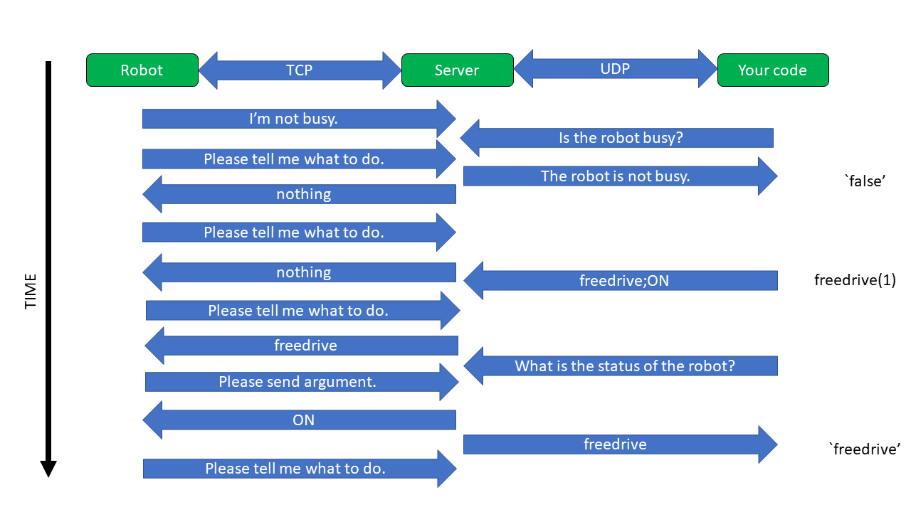
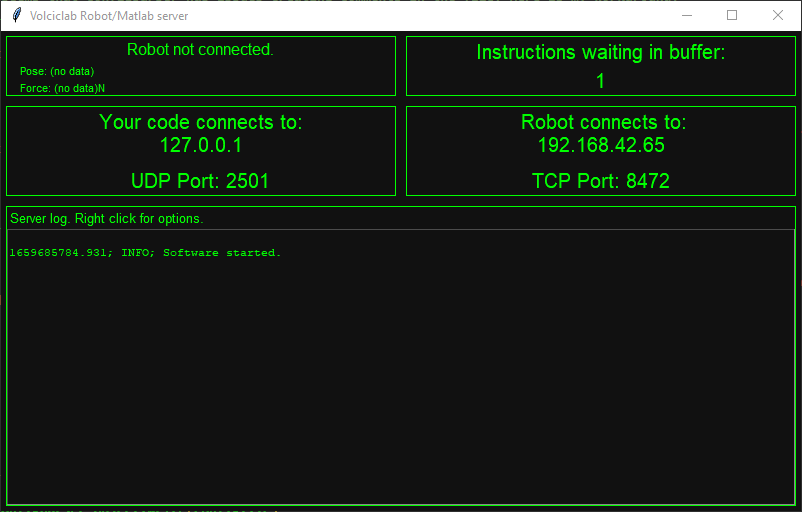
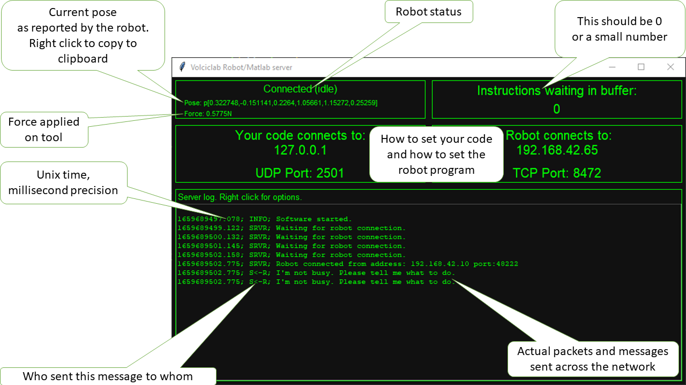

# The Volciclab robot implementation

***

**WARNING:**
**This is RESEARCH SOFTWARE which is intended to be run in experiments situated in a controlled and isolated lab environment.**
**It is not intended for production use.**
**This implementation allows LITERALLY ANYONE WITH NETWORK ACCESS to control the robot.**
**Use with caution, understand what are you doing. Stay safe.**

***

## But first, a bit of robotics terminology

A **teach pendant** is a robot controller human interface. You can change the robot's  **installation** settings, you can load a **program** and execute it, and you can also change **safety settings**, by adding a plane below which the robot can't move for example. You can also specify the maximum speed and acceleration of the robot, and if supported, configure the attachments too.

The **tool contact point** is at the end of the robot. It is important that both the dimensions and the weight of the tool is specified correctly, because the robot monitors the force on the tool. If the robot detects that an unusually high force is required or measured on the tool, it will do a **protective stop**. In this narrative the **tool** is whatever device that gets attached to the robot. In manufacturing, where robots are mostly common, the tool can be screwdriver, a welding pistol or indeed a flamethrower. In the lab, it can be whatever 3D printed contraption that is required by the experiment.

The robot has three **joints**, the shoulder that is closest to the base, the elbow, and the wrist that is closest to the tool. The robot's **pose** is a configuration of the angles of these joints, that will determine the position and orientation of the tool contact point (or 'tcp' all lowercase, which is not to be confused with the network protocol 'TCP', all in capitals).

**Forward kinematics** is the process of calculating the position and orientation of the tool contact point from the joint angles, and conversely, **inverse kinematics** is the process of calculating the required joint angles for a given tool contact point position and orientation.

**Freedrive** gives the impression of the robot joints not being controlled by the controller, so the robot can be moved manually. In this mode, you can touch the robot, and you can set into whatever pose the joints allow. If the robot starts to quickly fall in this mode and ends in propective stop, then adjust the weight of the tool in your tool definition.
***
In the Volciclab implementation, the **teaching** of the robot is the process of switching into freedrive, moving the robot to the required pose and recording the pose string that is displayed on the server. Then, in the Matlab code, you can call these poses in sequence.
***
## How the robot is controlled with this implementation

This system has three components:

* The [URScript](#the-urscript-code-running-on-the-robots-controller) code that is running the robot's controller
* [The Server](#the-server), written in Python
* [The Matlab code](#the-matlab-code-volciclab-robotics-toolbox), that runs on the experimental computer.

In order to get started, you need to be familiar with the lab network, so you would know the IP addresses concerned. Then, if required, edit the URScript on the teach pendant, and possibly you need to edit the server's config file too.

In general, this is the sequence for the robot to work:

1. Start the server.
2. Start the robot, run the program. Verify the robot's connection to the server.
3. Start Matlab and run your code.

## Network and communication protocols

The communication between the robot and the server is implemented via [TCP](https://en.wikipedia.org/wiki/Transmission_Control_Protocol). For simplicity, communication between the server and your matlab code is implemented with [UDP](https://en.wikipedia.org/wiki/User_Datagram_Protocol). This means that while the server can detect the loss of connection between the robot and the server, you do not have this facility for your Matlab code.



During normal operation, there is continuous communication between the robot and the server. At the same time, concurrently, there is intermittent communication between your matlab code and the server. If the robot is busy executing a previous instruction or busy talking to the server, the server will store your messages in a buffer until the robot is asking for them. You don't have to check manually if the robot is busy: if you want to send it a series of movements, just do so and the robot will execute it when it has time. But, if you need to wait for the robot to finish whatever it's doing, you can just wait until the robot reports as not busy.

What you see in the above figure is the actual plain text messages across the network. You can use [Wireshark](https://www.wireshark.org/) to monitor them.

## The URScript code running on the robot's controller

The robot is controlled via an opcode-argument pair. The code first checks for an opcode, and if required, requests the server for an arugment. Following some basic sanity checks, the appropriate instruction is executed.

The code is divided to three parts:

* The **main** part, where you need to set the IP address of the server, so the robot will know where to connect to. The `server_ip` variable will need to be updated to wherever the server is running.

```URScript
Robot Program
     'Global variables for telling the robot what to do. One instruction at a time.'
     server_ip≔"192.168.42.65"
     opcode≔"nothing"
     freedrive≔ False
     op_argument≔"null"
     Call connect_to_server
     Loop
       Call check_for_instruction
       Call execute_opcode

```

* The **`check_for_instruction`** part, which hammers on the server for new instructions. This instruction can be `nothing`. If an instruction is not received in time, say because the server is crashed, the robot will protectively stop.

```URScript
check_for_instruction
     'This one hammers on the server, and checks for new instructions'
     If freedrive ≟ False
       'Only report not busy, if not in freedrive.'
       socket_send_string("I'm not busy. ")
     opcode≔"nothing"
     Loop opcode≟("nothing")  or opcode≟""
       socket_send_string("Please tell me what to do. ")
       opcode = socket_read_string()
       'Update TCP on the server when there is nothing else to do.'
       current_tcp≔get_actual_tcp_pose()
       current_force≔force()
       socket_send_string(current_tcp)
       socket_send_string("f=")
       socket_send_string(current_force)
       socket_send_string("; ")
     'Let the server know that we are on it'
     textmsg("Received opcode is: ", opcode)
```

* The **`execute_opcode`** part, which, when gets the instruction string, may request and additional argument, and then executes the instruction.

This is implemented with a lot of string comparison statements. You can add your own here. For example, let's check freedrive:

```URScript
'Enable/disable freedrive'
     If opcode≟"freedrive"
       socket_send_string("Please send argument.")
       freedrive_arg = socket_read_string()
       If (freedrive_arg ≟ "ON")  or (freedrive_arg ≟ "On") or (freedrive_arg ≟ "on")
         freedrive_mode()
         freedrive =  True
         socket_send_string("Freedrive mode enabled.")
         textmsg("Freedrive mode is on.")
       Else
         end_freedrive_mode()
         freedrive =  False
         socket_send_string("Freedrive mode disabled.")
         textmsg("Freedrive mode is off.")
```

You can see that URScript treats strings in a case sensitive manner.

## The currently implemented available robot commands are:

### **`move_tcp`**. The robot will report as busy while executing

This is the most commonly used command. This moves the previously defined 'tool contact point' to the required position. In URScript, the 'pose' of the robot is stored as a vector of 6 floating-point numbers, in the following format:

```URScript
p[X, Y, Z, Rx, Ry, Rz]
```

the `p[` bit is required for the URScript to process the pose. This is sent directly to the server from your Matlab code as a string. The triplet of `X`, `Y` and `Z` are cartesian coordinates, with respect of the base of the robot. The `Rx`, `Ry` and `Rz` bits are Euler angles, in radians.

**IMPORTANT:**
This operation will fail if:

* the pose is unreachable
* the robot crashes into anything, including itself
* the coordinates are not formatted properly

### **`freedrive`**. The robot will not report as busy while executing

This sets the robot into freedrive mode. Only one argument is needed. `ON` or `OFF`. Note that the safety limits are still active, so if you move the robot too fast or into a limit, then it will do a protective stop.

### **`set_gripper`**. The robot will report as busy while executing

If the gripper attachment is connected and the correct program is loaded that actually handles the gripper, then this will open the gripper to the required position. 100 is fully closed, and 0 is fully open.

### **`update_tcp`**. The robot will not report as busy while executing

If possible, please use the teach pendant to set this.

This updated the tool contact point definition with respect to the tool socket of the robot. The 'tool contact point' definition is is stored as a vector of 6 floating-point numbers, in the following format:

```URScript
p[X, Y, Z, Rx, Ry, Rz]
```

the `p[` bit is required for the URScript to process the pose. This is sent directly to the server from your Matlab code as a string. The triplet of `X`, `Y` and `Z` are cartesian coordinates, with respect of the base of the robot. The `Rx`, `Ry` and `Rz` bits are Euler angles, in radians.

## The server

The pupose of the server is to handle all connection to the robot, to monitor its pose and the force applied on the tool, and to produce diagnostic messages when required. Additionally, the server provides a communication interface with the third-party application, such as your Matlab code. The entire implementation is done as a single Python script, with less than 1000 lines of code and large number of comments and removed sections.

### How it works

Everything is implemented from core python libraries. [ConfigParser](https://docs.python.org/3/library/configparser.html) is used to read and generate the config file if it doesn't exist, [tkinter](https://docs.python.org/3/library/tkinter.html) which is a wrapper for [Tcl/Tk](https://www.tcl.tk/) is used for the GUI. For FIFO (First In First Out) operations, [deque](https://cplusplus.com/reference/deque/deque/) objects are used. Both servers are implemented using [socket](https://docs.python.org/3/library/socket.html). In order to avoid confusion, all timestamps are [UNIX](https://unixtime.org/) times, rounded up the nearest millisecond.

There are three threads, these are executing concurrently:

* **The TCP server.**
While the actual creation of the TCP socket is easy, specific measures needed to be taken for timeouts. Also, the robot sometimes closes the connection, and dedicated timeouts had to be introduced, hence the nested `try:` and `except:` statements. The contents of the packets are analysed using Python's string functions.

* **The UDP server.**
This implementation is fairly straightforward: the socket is created, and the contents are analysed. Some messages require responses, which is implemented here.

* **The GUI refresher.**
This should be done in the main thread, but it didn't work. For the data strings that require live updates, the latest information is fetched here. For the log strings, which are ever-increasing, special measures needed to be taken to find what is the latest line. Also, if the user decides to delete the log, a diagnostic message is added here.

The main thread draws the GUI and handles user-induced events such as mouse clicks, dialogue boxes and prompts.

#### Inter-thread communication

Every thread has access to these global variables. Appropriate [MUTEX](https://en.wikipedia.org/wiki/Mutual_exclusion)-es are set up inside these threads to avoid corruption of data when there is more than one thread wants to write into them.

```Python
  # Get all our global variables that we will ever need.
    global tcp_server_ip
    global tcp_port
    global udp_server_ip
    global udp_port
    global robot_busy
    global robot_status
    global robot_force
    global command_fifo
    global log_string_array

    global keep_running
```
The IP addresses and ports are are required for network interface initialisation.

For the robot-related variables, while `robot_busy` is a boolean, everything else (`robot_status`, `robot_force`) is a string.

The `command_fifo` is a deque of string tuples, which stores the opcode and argument for the robot. Again, this is all in plain text.

The `log_string_array` is where the diagnoistic messages are stored. These are displayed in the GUI, and optionally can be saved into a file.

Finally, `keep_running` is also a boolean, and when set to false all threads will join (terminate).

#### The config file

The code will generate an example config file when it can't find or read it. This is in standard `.ini` syntax. This is where the server's IP addresses and ports can be set. You can also reconfigure the colours, window dimensions and window position of the GUI window. Just in case, if you don't like green on black :).

```ini
[Servers]
; this is the server the robot connects to: this should be your local address in text format, such as: tcp_server_ip = 192.168.42.100
tcp_server_ip = 192.168.42.65
tcp_port = 8472
tcp_connection_loss_timeout = 3
; this one is your software interface: this runs on the same computer you are running your other scripts from, it can be set as: udp_server_ip = 127.0.0.1
udp_server_ip = 127.0.0.1
udp_port = 2501

[GUI]
; you can specify the window size, in pixels: window_size = 800x480
window_dimensions = 800x480
; for multi-monitor set-ups, you can manually set the window position, so the window will be placed to a different monitor. window_position_offset = +x+y
window_position_offset = +100+100
window_font_size = 15
window_text_colour = lime
window_background_colour = #111111

```

### The main window

This window has several sections. When the server starts up, you can see that there is an instruction waiting in the buffer. As soon as the robot is connected to the server, the first instruction is to do nothing.



Once the robot is connected, the server's main window work as a glorified status display and data logger. It shows instructions on how to connect the robot, how you should set your code, and what is the current pose of the robot. There are right click menus where you can save the log or copy the current pose as a string. You can directly paste this to Matlab.



* **The top left corner:**
There are three lines here: The first line is the robot status. You can access this string directly from Matlab.
The second line is the robot's current pose expressed as the tool contact point. This is in the X, Z, Z, Rx, Ry, Rz format: X, Y, Z are cartesian coordinates with respect to the base the robot, and Rx, Rx, Rz are the Euler angles in radians. You can also access this directly from Matlab too.
The third line is the current force measured on the wrist joint of the robot, after compensating for the tool's weight itself, again, accessible from Matlab as well. The unit is Newton.

* **The top right corner:**
This shows how many instructions are currently stored on the server. You can send a high number of instructions for the robot to execute and do something else in the meantime in your code, or you can send a single instruction, wait for it to execute, and then send it an other one. This non-blocking/blocking method of operation can be useful when automating experiments, or using collaborative robotics.

* **The middle section:**
These are just read from the `.ini` file and displayed. You can set the port to whatever you want to. If the server is running on a different computer than your code, then the `udp_server_ip` should be set to that computer's IP address.
For the Robot connection, you may need to update the URScript using the teach pendant, and this big numbers help reading the server's screen from a distance.

* **The bottom section:**
This is a simple log window. Normally you don't need this, but if there are connection anomalies or timeout problems, this may be helpful. Each line has three sections: the time, the label, and the log content.

The labels are:

`INFO;` General information displayed by the server code

`SRVR;` Network-related messages

`S<-R;` Robot to server message

`C->S;` Client (your code) to server message

`S->R;` Server to Robot message

The log content is directly extracted from the network packets. They are plain ASCII text and completely unencrypted.

## The Matlab code (Volciclab Robotics Toolbox)

It is not really necessary to collect this code into a separate toolbox. It's really just a handful of functions wrapped around some UDP networking with added sanity checks. To control the robot from Matlab, no custom functions are required at all, it can be done directly by following these steps.

* Initialise the UDP networking facility in Matlab.

```Matlab
% Initialise the UDP object
udp_object = udpport('IPV4', 'Timeout', 0.1); % 100 ms timeout
```

* Send a UDP packet to the server with the instruction.

```Matlab
% Set the robot to freedrive mode
write(udp_object, 'freedrive;ON', '127.0.0.1', 2501);
```

* Optionally, we may expect a reply. In this case, this is implemented in a query-delay-respone format. Using the `udp_object` declared above,

```Matlab
% Query: get the status string from the server
write(udp_object, 'What is the status of the robot?', '127.0.0.1', 2501);

% Delay
pause(0.1)

% Read response. Plain text.
response = read(udp_object, udp_object.NumBytesAvailable, 'string');
```

### Script and function listings

These are convenience scripts and wrapper functions. They have error management and some script analysis.

---

#### **`volciclab_robot_config.m`**

For easier access to fine-tuning network settings, the network-specific configuration is assembled into a single structure. This structure is the `volciclab_robot_config_struct`, and is used as the first argument for every function listed here.
It is initialised as follows:

```Matlab
volciclab_robot_config_struct = struct;

% How much time we should wait for a UDP request reply?
volciclab_robot_config_struct.udp_timeout = 0.1; % In seconds.

% Create the UDP object inside the structure. We use the same timeout value
% for the incoming buffer as well.
volciclab_robot_config_struct.udp_object = udpport("IPV4", "Timeout", volciclab_robot_config_struct.udp_timeout);


% How to connect to the robot server?
volciclab_robot_config_struct.ip_address = '127.0.0.1';
volciclab_robot_config_struct.port = 2501;
```

**If the server is running on different computer than your Matlab code, change the ip address of `127.0.0.1` to whatever the server is running on.**

***

#### **`volciclab_robot_freedrive(robot_config_struct,on_or_off)`**
This function switches the robot's freedrive mode on or off.

```Matlab
%   Input arugments are:
%   -robot_config_struct, which tells how the robot is connected.
%   -on_or_off, which could be a boolean, a number, or a string:
%       true, 1, 'ON', 'On', 'on' turns on freedrive mode
%       literally anything else turns it off
```

There is no return value. Check the server window whether it worked or not.

***

#### **`robot_force_in_newtons = volciclab_robot_get_force(robot_config_struct)`**

This function gets the current force applied to the robot's tool in Newtons.

```MAtlab
%   Input argument is:
%   -robot_config_struct, which has the connection details.
%   Returns:
%   -If the robot is connected and getting data, then the appropriate force
%   is returned.
%   -If the robot is not connected, then it returns a NaN
```

***

#### **`reply_string = volciclab_robot_get_status(robot_config_struct)`**

This function gets the latest robot status string.

```Matlab
%   I don't think I need to explain this any further, but this is the same
%   string you see in the top left corner of the server window. There you
%   have it! :D
%   Input argument is:
%   -robot_config_struct, which has the connection details.
%   Returns:
%   ...a string with the robot status in it.
```

***

#### **`robot_busy = volciclab_robot_is_busy(robot_config_struct)`**

This function returns true if the robot is busy, and false if the robot is not busy.

```Matlab
% Input argument:
%   -robot_config_struct, which has the connection details.
% Returns:
%   -True if the robot is busy, false is when the robot is not busy.
```

***

#### **`robot_connected = volciclab_robot_is_connected(robot_config_struct)`**

This function checks if the robot is connected to the server.

```Matlab
% Input argument:
%   -robot_config_struct, which has the connection details.
% Returns:
%   -True if the robot is connected, false is when the robot is not connected.
```

***

#### **`volciclab_robot_move_tcp(robot_config_struct, new_pose)`**

This function instructs the robot to move the tool contact point, so this moves the robot's end to the desired position. The pose must be reachable and within safety limits.

```Matlab
%   Input arugments are:
%   -robot_config_struct, which tells how the robot is connected.
%   -new_pose, which is a vector with 6 values. These are:
%           -X, Y, Z, which is the tool contact point's coordinates
%           -Rx, Ry, Rz, which is the tool contact point's rotation IN RADIANS!
%   There are no return values, you should see either the robot move, or
%   the instruction being stored on the server.
```

***

#### **`volciclab_robot_set_gripper(robot_config_struct, new_gripper_value)`**

This function sets the gripper on the robot. The gripper must be mounted, connected, and the correct robot program must be loaded before this function can be called.

```Matlab
%   Input arugments are:
%   -robot_config_struct, which tells how the robot is connected.
%   -new_gripper_value, which is a number between 0 and 100.
```

***